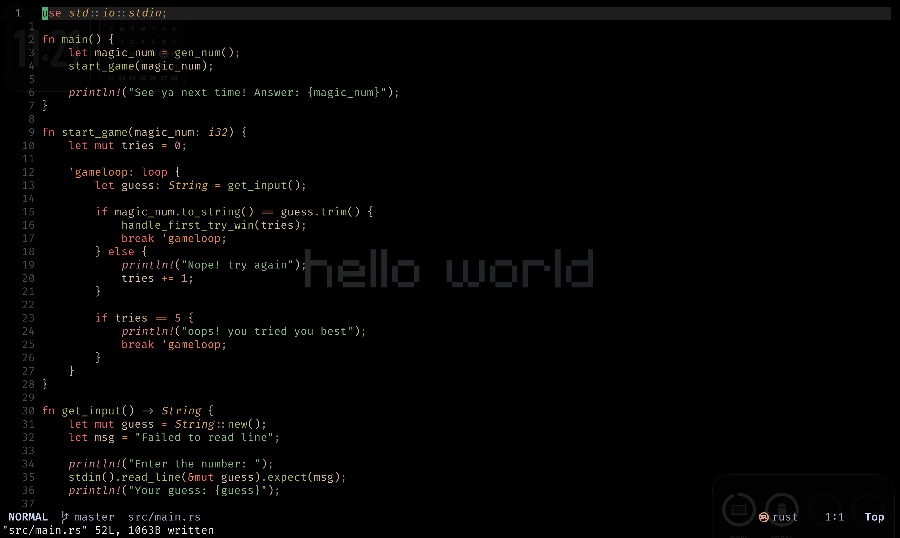

# Neovim Configuration

A modern Neovim setup with Lua, featuring a dark theme, LSP + conform formatting, Telescope, and more.



---

## Quick Overview

| Feature | Plugin/Feature |
|---------|---------------|
| Theme | Gruvbox Material |
| Completion | Blink.cmp (modern cmp replacement) |
| LSP | nvim-lspconfig + Mason |
| Formatting | conform.nvim (with lsp fallback) |
| Fuzzy Finder | Telescope |
| Git | Fugitive, Diffview, Gitsigns |
| Navigation | Harpoon2 |
| Statusline | Lualine |
| Surround | mini.surround |

---

## Keybindings

### General

| Key | Action |
|-----|--------|
| `Esc` | Clear search highlight |
| `jk` / `kj` | Exit insert mode |
| `<C-c>` | Copy to system clipboard (visual) |
| `<leader>e` | File explorer (Oil) |
| `<leader>g` | Git status (Fugitive) |
| `<leader>cf` | Format buffer (conform) |
| `<leader>tF` | Toggle autoformat (buffer) |

### Telescope (Fuzzy Finder)

| Key | Action |
|-----|--------|
| `<leader><leader>` | Find files |
| `<leader>fs` | Live grep |
| `<leader>fg` | Git files |
| `<leader>fb` | Buffers |
| `<leader>fd` | Diagnostics |
| `<leader>fh` | Help tags |
| `<leader>fr` | Recent files |

### Harpoon (Quick Navigation)

| Key | Action |
|-----|--------|
| `<leader>a` | Add file to harpoon |
| `<C-e>` | Toggle harpoon menu |
| `<leader>h` | Jump to file 1 |
| `<leader>j` | Jump to file 2 |
| `<leader>k` | Jump to file 3 |
| `<leader>l` | Jump to file 4 |
| `<C-[>` | Previous harpoon file |
| `<C-]>` | Next harpoon file |

### Git (Gitsigns)

| Key | Action |
|-----|--------|
| `]c` / `[c` | Next/previous hunk |
| `<leader>ghs` | Stage hunk |
| `<leader>ghr` | Reset hunk |
| `<leader>ghp` | Preview hunk |
| `<leader>ghb` | Blame line |
| `<leader>ghd` | Diff this |

### Trouble (Diagnostics)

| Key | Action |
|-----|--------|
| `<leader>xx` | Toggle diagnostics |
| `<leader>xX` | Buffer diagnostics |
| `<leader>cs` | Toggle symbols |
| `<leader>cl` | LSP definitions/references |
| `<leader>xL` | Location list |
| `<leader>xQ` | Quickfix list |

---

## LSP Servers

- `lua_ls` - Lua
- `gopls` - Go
- `vtsls` - TypeScript/JavaScript

---

## Visual Animation Demo

```
╭────────────────────────────────────────────────────────────╮
│  N  📁 init.lua  ●  󰅩 10:30  [No Name]                     │
├────────────────────────────────────────────────────────────┤
│                                                            │
│  1 │ require("abx")                                        │
│  2 │                                                       │
│    │                                                       │
│    │ 💡 Try: <leader><leader> to find files                │
│    │                                                       │
│                                                            │
│                                                            │
│                                                            │
│                                                            │
├────────────────────────────────────────────────────────────┤
│ NORMAL | init.lua | 10:30 | 1/1 | 100%                     │
╰────────────────────────────────────────────────────────────╯

[Telescope Opens - Vertical Layout]

┌────────────────────────────────────────────────────────────┐
│  Find Files                                                │
├────────────────────────────────────────────────────────────┤
│  > .gitignore                                              │
│    .luarc.json                                             │
│    init.lua                                                │
│    lazy-lock.json                                          │
│    lua/                                                    │
│    after/                                                  │
│    lsp/                                                    │
├────────────────────────────────────────────────────────────┤
│  .gitignore                              ████████████ 68%  │
├────────────────────────────────────────────────────────────┤
│                                                            │
└────────────────────────────────────────────────────────────┘
```

---

## Installation

```bash
# Backup existing config
mv ~/.config/nvim ~/.config/nvim.bak

# Clone this config
git clone https://github.com/yourusername/dotfiles.git ~/.config/nvim

# Open Neovim (Lazy will install plugins automatically)
nvim
```

---

## Requirements

- Neovim >= 0.10.0
- Git
- Nerd Font (for icons)
- ripgrep (for Telescope live_grep)
